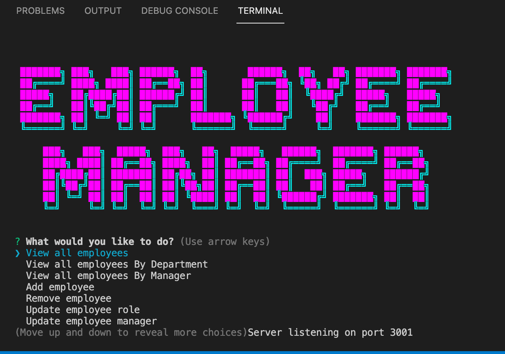

# CLI-Employee Tracker ©2021 

## Description

This is a node command line employee tracker that a manager may use to keep track of employees, view salaries and update employee information as needed.

Project by: Aimee Jesso  
Main Github: [MissAimeeJay](https://github.com/MissAimeeJay)
Repository Link: https://github.com/MissAimeeJay/CL-Employee-Tracker  
Live Page Url:  None
[Video showing code and use](https://drive.google.com/file/d/1X1vfQ5-3qPXs6FZm8oNXiLwvx5VjizGL/view)

## Table of Contents

* [Installation](#installation)
* [Usage](#usage)
* [License](#license)
* [Testing](#testing)
* [Questions](#questions)

## Installation
This cli app requires express, npm, node, npm CFonts, mysql2 and npm inquirer to run.  Dotenv has been added but for the sake of sharing work, the password has been set to a default of "password" and the username is set to a default of "root".

## Usage 
This app is ideal for any worker or business owner that has staff subordinates to manage.  Managers will be able to update role and salary at app completion.  

## License
Unlicensed
[Click here for more information on this license](https://choosealicense.com/licenses/unlicense)

## Testing
Suggesting testing for this app is to use MySql workbench to obtain a visual of database, and simply to use the command line and run through the choices available.

## Questions
If you have questions or would like to contact for other reasons, please contact
Aimee Jesso  
Email: ajesso@post.com
Main Github: [MissAimeeJay](https://github.com/MissAimeeJay)